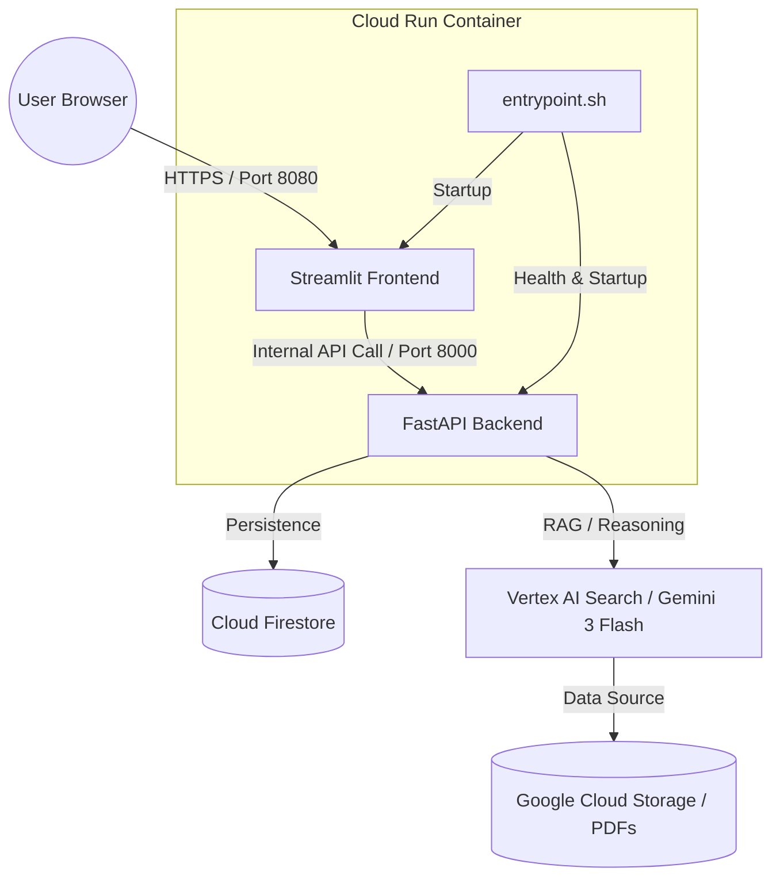

# ARCHITECTURE_OVERVIEW.md

## High-Level Architecture
The system follows a "Sovereign Node" architecture, encapsulated within a single Google Cloud Run container for simplified deployment and cost-efficiency.

## Component Breakdown

### 1. Frontend (Streamlit)
- **Role:** User interface and session state management.
- **Connectivity:** Communicates with the Backend via internal `127.0.0.1:8000` (FastAPI).
- **State:** Persists `session_id` in URL query parameters.

### 2. Backend (FastAPI)
- **Role:** Orchestration of agent logic and persistence.
- **AI Agent:** Modular implementation using `vertexai` Python SDK.
- **Grounding:** Configured with Vertex AI Search (Grounding Service).

### 3. Persistence Layer (Firestore)
- **Model:** Document-oriented, optimized for chronologically ordered message streams.
- **Integrity:** Enforces immutable records for legal compliance.

### 4. CI/CD Pipeline (GitHub Actions)
- **Flow:** Code Push -> Docker Build -> Artifact Registry -> Cloud Run Deploy.
- **Security:** Injects secrets (GCP_SA_KEY, DATA_STORE_ID) at build/runtime.